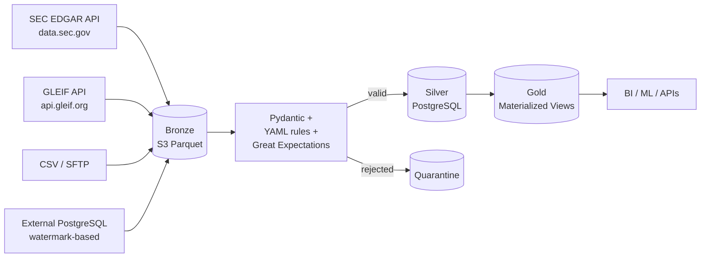

# LegalDataPlatform

ETL/ELT platform for legal and commercial data.

!!! info "What this documentation covers"
    Architecture, pipelines, database optimization, data quality, AWS deployment,
    and the decision rationale behind each choice. Built to pass both an automated
    CI suite and a senior technical interview.

## At a glance

| | |
|---|---|
| **Language** | Python 3.11+ (async) |
| **Database** | PostgreSQL 16 (partitioned, indexed, MVs) |
| **Orchestration** | Prefect 2 |
| **Cloud** | AWS (S3, Lambda, Glue, SQS, Aurora) |
| **IaC** | Terraform |
| **CI/CD** | GitHub Actions (6 jobs: lint, unit × 2, integration, security, docker) |
| **Lint** | ruff + mypy |
| **Testing** | pytest-asyncio, pytest-benchmark, moto, Testcontainers-style |

## Quick links

- [Architecture](ARCHITECTURE.md) — diagrams and patterns
- [Pipelines](PIPELINES.md) — extractors, transformers, loaders, orchestration
- [PostgreSQL Optimization](POSTGRESQL_OPTIMIZATION.md) — partitioning, indexes, MVs, tuning
- [Data Quality](DATA_QUALITY.md) — three lines of defense
- [AWS Deployment](AWS_DEPLOYMENT.md) — Terraform, costs, DR
- [Talking Points](TALKING_POINTS.md) — decision rationale for interviews
- [Walkthrough](WALKTHROUGH.md) — the complete technical story

## Real data sources integrated



## Pipeline stats

What the CI validates on every push:

- **Integration tests** — COPY bulk correctness, UPSERT semantics, JSONB handling, SCD2 point-in-time queries, partition pruning via EXPLAIN.
- **Unit tests** — Pydantic schemas, YAML rule engine, deterministic hashing, mock-based extractor validation (SEC EDGAR + GLEIF).
- **Security** — pip-audit CVE scan + bandit static analysis.
- **Docker build** — multi-stage image builds successfully.

See [evidence](evidence/README.md) for runtime captures on a real machine.

## Get started

```bash
git clone https://github.com/henriquezbh5-cpu/legaldataplatform
cd legaldataplatform
cp .env.example .env
python -m venv .venv && source .venv/bin/activate
pip install -e ".[dev]"
docker compose up -d
alembic upgrade head
python scripts/seed_data.py
make pipeline
```

UIs: [Prefect](http://localhost:4200) · [MinIO](http://localhost:9001) · [Prometheus](http://localhost:9090) · [Grafana](http://localhost:3000)
